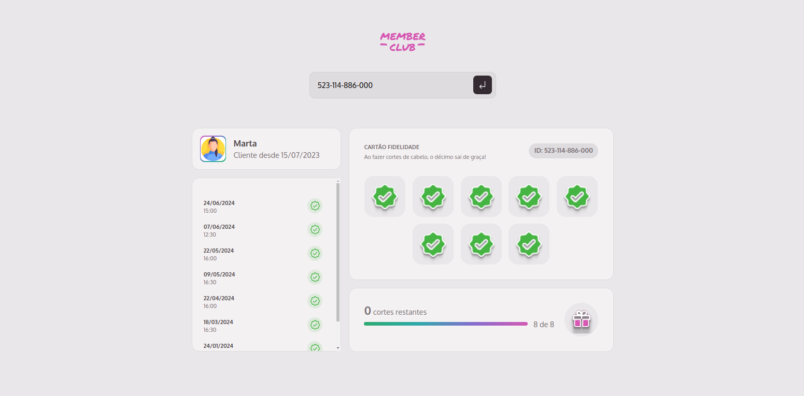
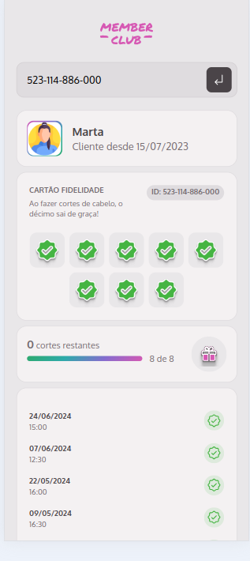

# Merber Club

|||
|---|---|
|||

Member club é uma aplicação de Cartão fidelidade, desenvolvido como desafio do módulo Fundamentos do Desenvolvimento Web do curso MBA Fullstack Rocketseat.

## Rodando a aplicação

```bash
# Clonar a aplicação
git clone git@github.com:MarianaBorges/member-club.git

# Abre a pasta do projeto 
cd member-club

# Baixa as dependencias do projeto
npm install

# Roda o json-server como os dados mockados
npm run server 

# Roda a aplicação 
npm run dev

```
## Tecnologias 

* HTML
* CSS
* JS
* Webpack
* json server
